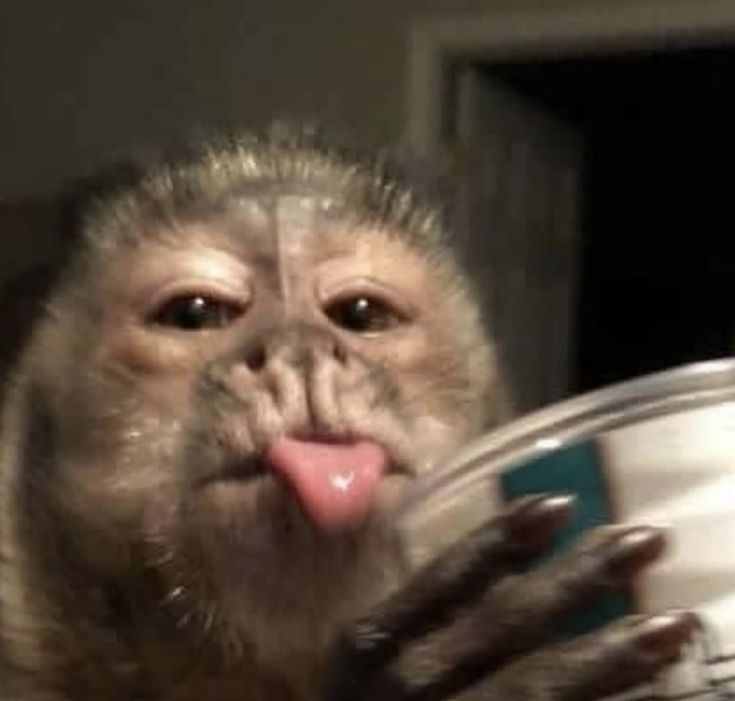
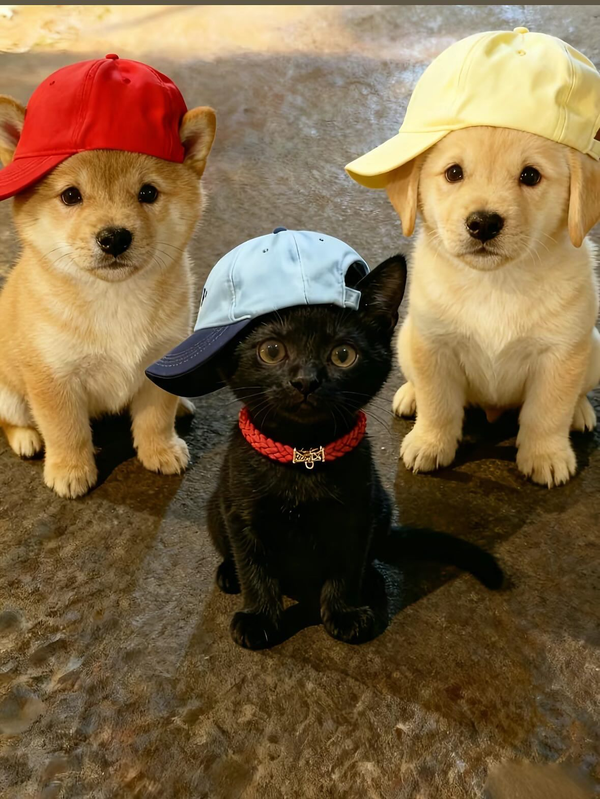

## Что было реализовано:

Разработала главную страницу
Доработала корзину: добавила чекбоксы и стильные иконки
Создала страницы авторизации и регистрации с модальным окном
Подключила localStorage для сохранения данных пользователей
Улучшила все стили для более привлекательного вида
Написала этот README
Реализовала полноценный поиск товаров с автодополнением и подсветкой результатов
Создала страницу избранного

